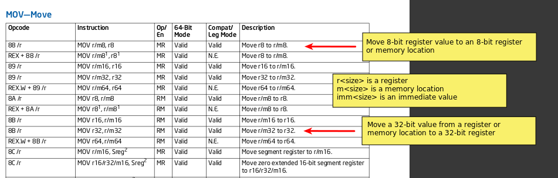

# 🧰 3-01 Tools - Knowledge

<span style="color:lightcoral">*"I can fix it!"*</span>
 ~-~ Felix

[Back to README](README.md)


## Primer Contents

In this tutorial, we will go over the following topics:

- [Assembly Tools](#assembly-tools)
- [Assembling](#assembling---nasm)
- [Installing NASM](#installing-nasm-on-linux)
- [NASM Documentation](#nasm-documentation)
- [NASM Tutorials](#nasm-tutorials)
- [Configuring IDE](#configuring-ide)
- [Disassembler Tools](#disassembler-tools)
- [Debugging Tools](#debugging-tools)
- [Intel Manual Reference](#intel-manual-reference)
- [Include References](#include-references)
- [Man Pages](#man-pages)
- [Sources](#sources)
- [Required Additional Readings](#required-additional-readings)
- [Resources](#resources)


## Assembly Tools

There are several tools that you will need to use to assist you in your 
assembly programming.  Some common tools include:

- `nasm` - Netwide Assembler.
- `gcc` - GNU C Compiler Collection.
- `ld` - Linker.
- NASM docs.
- NASM tutorials.
- `code` - VS Code IDE.
- `objdump` - Object Dumper (disassembler).
- `gdb` - GNU Debugger.
- Intel® 64 and IA-32 Architectures Software Developer's Manual 
- `/usr/include/x86_64-linux-gnu/asm/unistd_32.h`
- `/usr/include/x86_64-linux-gnu/asm/unistd_64.h`
- `man syscall`


## Assembling - NASM

You will need to be familar with basic use of an assembler.  There are multiple 
ways to use assembly code.  You can use a C compiler and link an assembly file 
to a C program; Visual Studio allows for inline assembly coding in C; or you 
can use an assembler program to assemble standalone assembly programs.  There 
are other ways as well, but those are the main ones.  In this tutorial, you 
will be learning how to assemble standalone programs and how to run assembly as 
a function call from a C program.

The main assembler used in this course is NASM.  This is much like using `gcc`. 
You create your assembly source file and then use `nasm` to assemble the 
code into an object file.  You will then need to convert your object file into 
an executable file and link your code to a C program or another assembly
source, if needed, using the `ld` command utility (linker) or `gcc` (required 
if you have a main function).  The linker will take your object files and 
create an executable program file.

<span class="box-purple"><span class="bar-purple">
    <span class="purple">**ⓘ**</span>&nbsp; Info   
</span><span class="inner">
    Note that Visual Studio does not support inline assembly for 64-bit
    assembly according to Microsoft's website.
</span></span>

More on this process will be described in later modules.


## Installing NASM on Linux

Test to see if you already have NASM:
``` sh
nasm --version
```

or 

``` sh
whereis nasm
```

If you do not have NASM, and if you are using a Debian-based distribution 
(such as Kali or Ubuntu), use `apt` to install NASM:

``` sh
sudo apt install nasm
```

Or download the archive file from the 
[NASM website](https://www.nasm.us/pub/nasm/releasebuilds/?C=M;O=D).  If you 
choose this approach, you can follow the guide in the 
[Tutorialspoint NASM Tutorial](https://www.tutorialspoint.com/assembly_programming/assembly_environment_setup.htm).  If you are using Fedora 
Linux, you can also use an RPM distribution [[1]](#sources).

You may need to download some 32-bit or 64-bit libraries if needed.  Examples 
may be given later in another module.  If you are having trouble, please ask 
an instructor.


## NASM Documentation

You can use documentation to see instructions and examples of how different 
components of NASM work. The NASM website has PDF and HTML versions of 
[NASM docs](https://www.nasm.us/doc/). The docs describe NASM syntax, usage, 
how to use the NASM preprocessor and macros, how to assemble different 
executable formats and architecture formats, and many other topics.


## NASM Tutorials

If you are having a hard time with assembly, you can search online looking for 
`nasm assembly` as keywords. You can use tutorials to see examples (e.g., 
[Tutorialspoint NASM Programming](https://www.tutorialspoint.com/assembly_programming/index.htm)
). Because there are so many different variations of assembly, some online 
resources will not be helpful. Be sure to include words like `64-bit`, `x86`, 
`nasm`, `linux`, `windows`, and `assembly` in your searches to make sure you 
are getting results for the type of assembly you are trying to learn about.


## Configuring IDE

For Visual Studio or Visual Studio Code, you can add plug-ins for assembly 
linting or syntax highlighting. It is recommended that you go to the 
`Extensions` section of VS Code, type `x86` in the search bar, and install 
the `x86 and x86_64 Assembly` plugin for syntax highlighting. You can also try 
some of the other available plugins if you want.

Alternatively, you can use Visual Studio or any other text editor or IDE.

For building programs, it is recommended you use command line or makefiles 
when starting out in general. Although, there are ways to configure IDEs to 
setup assemblers and linkers for you (e.g., if you are writing Windows 
assembly in Visual Studio (not Visual Studio Code), there are configuration 
steps to setup NASM or MASM you will probably have to do in order to use 
solution files). 


## Disassembler Tools

There are many disassemblers you can use if you want to see how your code 
changed after assembly, compilation, or linking. You can use an online 
assembler/disassembler like 
[defuse.ca](https://defuse.ca/online-x86-assembler.htm), or you can use 
something like [Ghidra](https://ghidra-sre.org/), 
[IDA](https://hex-rays.com/ida-free/), [Hopper](https://www.hopperapp.com/), 
[Binary Ninja](https://binary.ninja/), 
[Radare 2](https://rada.re/n/radare2.html), etc.

For general disassembly, this course recommends using the `objdump` utility 
on Linux. Use the `-d` option for disassembly and the `-M intel` option 
for setting Intel syntax.

Example:

``` sh
objdump -d -M intel <file_to_disassemble>
```


## Debugging Tools

For Linux or Windows using the MinGW compiler, you can use `gdb` (GNU Debugger) 
for assembly. Alternatively for Windows, you can use `windbg` (Windows 
Debugger). There are other debuggers and IDE debugging setups that you could 
use as well.

There are other debugging techniques as well:

- ***Rubberduck Debugging*** - verbally walk through code starting at the 
beginning. Explain each step outloud to another person or a "rubberduck" to 
process your logic to find bugs. This method is very effective for finding 
logic errors and some syntax errors.

- ***IDE Debugging*** - if you can setup your IDE to do debugging, you can 
general set up break points and examine variable values in a GUI.

- ***Standalone Debuggers*** - there are debugging programs that can be run with 
your executable as an input. Then you can examine memory, step through code 
execution, and find bugs. `gdb`, `windbg`, and `x64dbg` fit in this category.

- ***Print Debugging*** - at key points in your code, you can add print
statements to see values of variables during execution to see if the values are
expected. This often helps the coder pinpoint where some bugs may be.  This can
be done in assembly as well if needed.

More on debugging and practice debugging will be given in a later module.


## Intel Manual Reference

You can use the [Intel Instruction Set Manual](https://cdrdv2.intel.com/v1/dl/getContent/671110) 
to find information on the x86 architecture and each specific instruction. 
Volume II of the Intel® 64 and IA-32 Architectures Software Developer's Manual 
has a listing of each instruction with information on how each instructions 
works and how it should be used.  Be sure to note that the PDF has navigation 
that can help you find the section you are looking for (usually on a navigation 
panel on the left of a PDF reader) (`Ctrl + F` may not be as helpful as usual 
due to the size of the manual). 

Here is an example of an instruction lookup in the Intel Manual.  You can 
find information on valid uses of the instruction:



Specifics on many operations will be given in later modules.


## Include References

On Linux, you can find useful information in the `include` directories. 

`/usr/include/x86_64-linux-gnu/asm/unistd_32.h` and 
`/usr/include/x86_64-linux-gnu/asm/unistd_64.h` give syscall numbers for 32-bit 
and 64-bit Linux.  More information on syscalls will be given in later 
modules.

<span class="box-purple"><span class="bar-purple">
    <span class="purple">**ⓘ**</span>&nbsp; Info   
</span><span class="inner">
    Different Linux distros may have *ASM* `includes` in different locations.
</span></span>


## Man Pages

Linux "man pages" are helpful for finding some information as well. `man 
syscall` reveals information about syscalls including calling conventions for 
different architectures and which register is used for calling syscalls (more 
information on this topic will be given in a later module). You can also use 
man pages to lookup up system and library functions. 


## Sources

1. *NASM Tutorial - Environment Setup*. 
https://www.tutorialspoint.com/assembly_programming/assembly_environment_setup.htm.


## Required Additional Readings.

None.


## Resources

1. ***NASM Docs***. 
https://www.nasm.us/doc/. 
Documentation for NASM utility.

2. ***NASM Programming Tutorial***. 
https://www.tutorialspoint.com/assembly_programming/index.htm. 
Tutorialspoint NASM tutorial with basic assembly information.

3. ***Microsoft Inline Assembler***. 
https://learn.microsoft.com/en-us/cpp/assembler/inline/inline-assembler?view=msvc-170. 
Information on setting up inline assembly for C/C++.

    <span class="box-purple"><span class="bar-purple">
        <span class="purple">**ⓘ**</span>&nbsp; Info   
    </span><span class="inner">
        This is not supported on x64 processors according to this article.
    </span></span>

4. ***Interesting Online GDB***.  https://www.onlinegdb.com/.  

5. ***GDB Website***.
https://sourceware.org/gdb/.  
Check out the `documentation` tab for manuals and other information.

6. ***Intel Reference Manual***. 
https://www.intel.com/content/www/us/en/developer/articles/technical/intel-sdm.html. 
Intel reference manuals for various topics.

7. ***Intel Instruction Set Reference***. 
https://cdrdv2.intel.com/v1/dl/getContent/671110. 
Critcal resource for detailed information on every CPU instruction for x86 
architecture with assembly instruction names.


[Back to Contents](#primer-contents)

[Back to README](README.md)

<link rel="stylesheet" href="../.css/boxes.css">


<!--- End of file. --->
